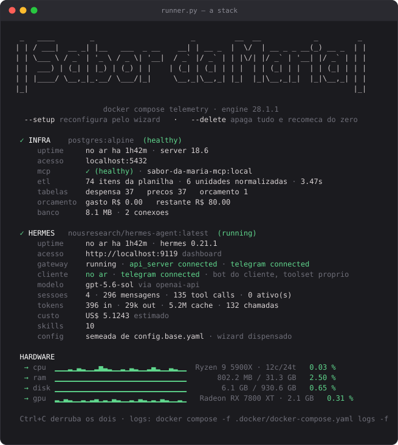
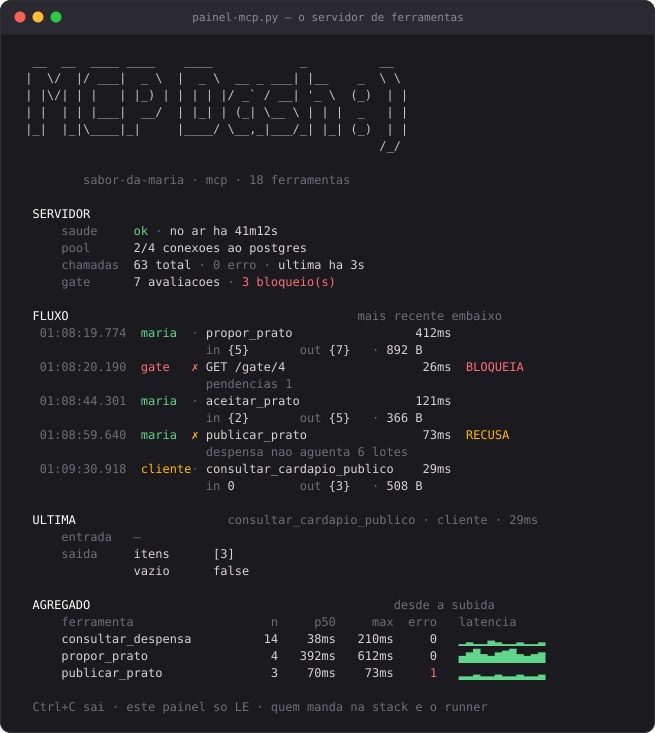
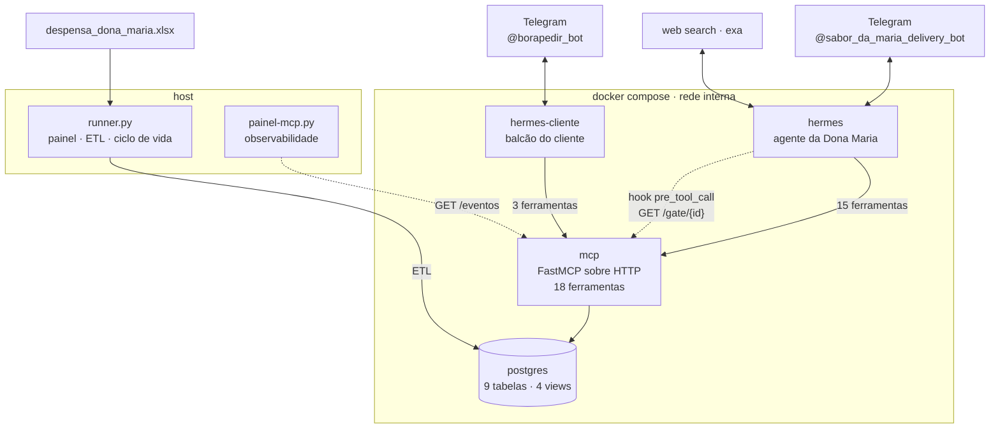

# Sabor da Maria

<p align="center">
  
   
  
</p>

<p align="center">
  <sub><b>runner.py</b> segura a stack e mostra o estado  ·  <b>painel-mcp.py</b> mostra o que o agente pediu, o que voltou e o que o gate decidiu</sub>
</p>

Agente de cardápio e precificação construído sobre o [Hermes Agent](https://github.com/nousresearch/hermes-agent), para o desafio técnico de Senior AI Software Engineer.

Leva a Dona Maria da despensa ao cardápio de lançamento: pesquisa receitas na web, descobre na conversa o que ela consegue cozinhar, compara com despensa e orçamento, calcula o CMV e propõe cenários de preço com a taxa de 10%. Depois publica o prato, um segundo bot simula o cliente comprando, e o caixa dela cresce.

---

## 1. Instalação

**Pré-requisitos:** Docker Desktop, Python 3.12+, chave de API de um provedor de LLM e
dois bots do Telegram.

```Java
pip install -r requirements.txt
cp .env.example .env      # preencher as variáveis abaixo
python .docker/runner.py
```

Não há wizard. O runner sobe os quatro containers, aplica a configuração versionada,
carrega a planilha no Postgres e segura o terminal num painel. `Ctrl+C` derruba tudo.

### Variáveis do `.env`

| variável                                                       | para quê                                        |
| --------------------------------------------------------------- | ------------------------------------------------ |
| `LLM_PROVIDER_API_KEY`                                        | chave do provedor do modelo                      |
| `TELEGRAM_BOT_TOKEN`                                          | bot da Dona Maria                                |
| `TELEGRAM_BOT_TOKEN_CLIENTE`                                  | bot do cliente — precisa ser**outro** bot |
| `TELEGRAM_ALLOWED_USERS`                                      | ids autorizados; vazio bloqueia todo mundo       |
| `DB_USER` `DB_PASSWORD` `DB_HOST` `DB_PORT` `DB_NAME` | Postgres                                         |
| `HERMES_DASHBOARD_BASIC_AUTH_*`                               | dashboard do Hermes                              |

### Comandos

| comando                               | o que faz                                              |
| ------------------------------------- | ------------------------------------------------------ |
| `python .docker/runner.py`          | sobe tudo e segura o terminal no painel                |
| `python .docker/runner.py --setup`  | wizard do Hermes, partindo da config versionada        |
| `python .docker/runner.py --down`   | derruba os containers, preserva o resto                |
| `python .docker/runner.py --reset`  | destrói o volume do banco                             |
| `python .docker/runner.py --delete` | destrói tudo, inclusive os dados dos agentes          |
| `python .docker/painel-mcp.py`      | dashboard do servidor MCP (aba separada)               |
| `python .docker/provar.py`          | provas de esquema e integração em banco descartável |
| `pytest`                            | 79 testes do domínio, sem Docker                      |

### Dependências

**No host** (`requirements.txt`): `colorama`, `PyYAML`, `openpyxl`, `psycopg[binary]` —
só o runner precisa delas.
**Na imagem do MCP** (`.docker/mcp.Dockerfile`): `fastmcp>=4.0`, `psycopg[binary,pool]>=3.2`.
**Nos agentes:** nada — imagem oficial do Hermes, sem modificação.

---

## 2. Estrutura do projeto

```Shell
.
├───.docker/                            # infra, perfis dos agentes e ferramentas de operação
│   ├───runner.py                       # sobe a stack, painel ao vivo e ETL da planilha
│   ├───painel-mcp.py                   # dashboard do MCP: chamadas, latência e o gate
│   ├───provar.py                       # sobe Postgres descartável e roda as provas
│   ├───docker-compose.yaml             # 4 serviços; portas publicadas só em loopback
│   ├───mcp.Dockerfile                  # imagem do servidor MCP
│   ├───db.sql                          # 9 tabelas, 4 views, COMMENT em cada uma
│   ├───db.prova.sql                    # 8 provas de esquema, em psql puro
│   ├───db.integra.py                   # 24 verificações do repo, com concorrência
│   ├───hermes-profile/                 # PERFIL DA DONA MARIA — versionado
│   │   ├───config.base.yaml            # saída literal do wizard; dispensa refazê-lo
│   │   ├───config.yaml                 # o delta: modelo, toolsets, MCP e hooks
│   │   ├───SOUL.md                     # o papel e a persona do agente
│   │   ├───agent-hooks/
│   │   │   └───gate-viabilidade.py     # o hook que bloqueia o aceite
│   │   └───skills/
│   │       ├───sabor-da-maria/         # 7 procedimentos, um por diretório
│   │       ├───grounded-citations/     # preservada do Hermes
│   │       └───blocked-page-recovery/  # preservada do Hermes
│   ├───hermes-profile-cliente/         # PERFIL DO CLIENTE — mesma estrutura, menos tudo
│   │   ├───config.yaml                 # 4 toolsets, 3 ferramentas
│   │   └───SOUL.md                     # persona de balcão, não de assistente
│   └───hermes-data*/                   # HERMES_HOME de cada agente — fora do git
├───src/backend/
│   ├───domain/                         # Python puro, sem I/O — 56 exemplos de doctest
│   │   ├───unidades.py                 # normalização, conversão e consolidação
│   │   ├───precificacao.py             # CMV, taxa, preço mínimo e cenários
│   │   └───viabilidade.py              # o gate como função pura
│   ├───mcp_server/
│   │   ├───server.py                   # as 18 ferramentas + 3 rotas HTTP
│   │   ├───repo.py                     # única camada que fala SQL
│   │   ├───observador.py               # telemetria do servidor, em anel de memória
│   │   └───__main__.py                 # entrypoint: abre o pool e sobe o HTTP
│   └───tests/                          # 79 testes com os valores reais da planilha
├───presentation/
│   ├───sabor-da-maria-deck.html        # slide-deck da apresentação, 10 slides
│   └───scenarios/
│       └───scenario.md                 # roteiro da demo, passo a passo
├───shared/                             # enunciado e planilha, como recebidos
├───.env.example                        # todas as variáveis, comentadas
├───pyproject.toml                      # config do pytest e dos doctests
└───requirements.txt                    # dependências do runner (host)
```

### Onde fica cada coisa

| pergunta                                    | resposta                                                                          |
| ------------------------------------------- | --------------------------------------------------------------------------------- |
| Onde o servidor MCP é definido?            | `src/backend/mcp_server/server.py`                                              |
| Onde as ferramentas são declaradas?        | mesmo arquivo, decorador`@mcp.tool`                                             |
| Quais ferramentas cada agente enxerga?      | `mcp_servers.sabor.tools.include` no `config.yaml` de cada perfil             |
| Onde o papel do agente é definido?         | `hermes-profile*/SOUL.md`                                                       |
| Onde ficam os procedimentos?                | `hermes-profile/skills/sabor-da-maria/*/SKILL.md`                               |
| Onde está o ETL da planilha?               | `runner.py`, função `carregar()`                                            |
| Onde a garantia do aceite é aplicada?      | `config.yaml` → `hooks.pre_tool_call` → `agent-hooks/gate-viabilidade.py` |
| Onde o SQL vive?                            | `src/backend/mcp_server/repo.py` e `.docker/db.sql`                           |
| Onde as regras de negócio são calculadas? | `src/backend/domain/` (puro) e views do `db.sql`                              |

---

## 3. Arquitetura



Os dois agentes **nunca trocam mensagem**. Coordenam pelo Postgres, através do mesmo
servidor MCP, com listas de ferramentas diferentes.

**MCP sobre HTTP, não stdio:** com stdio o servidor rodaria dentro do container do
Hermes e precisaria de `psycopg` e do `domain/` naquela imagem, que não tem `pip`. Como
serviço próprio, traz as próprias dependências — e HTTP é multi-cliente, o que permite
dois agentes num servidor só.

### Banco — tabelas

| tabela                  | o que guarda                                                       |
| ----------------------- | ------------------------------------------------------------------ |
| `despensa`            | projeção da aba*Despensa*, com unidade normalizada             |
| `precos`              | projeção da aba*Precos*, com `custo_unitario` derivado       |
| `orcamento`           | linha única: os R$ 80 iniciais                                    |
| `perfil`              | o que a Dona Maria confirmou: utensílios, técnicas, restrições |
| `pratos`              | candidatos, com status`sugerido` / `aceito` / `recusado`     |
| `pratos_ingredientes` | o que cada prato consome — o**ledger**                      |
| `compras`             | complementos comprados com o orçamento                            |
| `cardapio`            | publicações;`retirado_em` nulo = no ar                         |
| `pedidos`             | as compras do cliente — única entrada de dinheiro                |

**`precos` guarda os dois custos.** `custo_unitario` é `GENERATED` e divide pela
quantidade **normalizada**; `custo_unitario_ingenuo` divide pela quantidade crua. Em 6
dos 37 itens a coluna `Unidade` traz a embalagem (`balde 2kg`, `un 100ml`), e a divisão
literal erra nos dois sentidos — superestima 2× nas embalagens grandes, subestima até
10× nas pequenas. São R$ 166,73 mal contados. O ingênuo fica no banco para ser
auditável, com `COMMENT` dizendo `NAO USE NO CMV`.

**`pedidos.preco_unitario` é copiado na compra**, não lido por FK: reajuste posterior
não reescreve o passado. `taxa` e `valor_liquido` são `GENERATED` — o banco calcula.

### Banco — views, e por que views

| view             | o que responde                                                       |
| ---------------- | -------------------------------------------------------------------- |
| `vw_estoque`   | despensa + compras − consumo dos pratos aceitos × lotes publicados |
| `vw_orcamento` | R$ 80 − soma das compras                                            |
| `vw_cardapio`  | o que está no ar, com porções vendidas e restantes                |
| `vw_caixa`     | orçamento − compras + vendas líquidas                             |

**Estoque e orçamento não são colunas decrementadas em lugar nenhum.** São calculados
a partir dos fatos: pratos aceitos, compras e pedidos.

O ganho é a **reversibilidade**. Se a Dona Maria desistir de um prato, o status vira
`recusado` e o estoque e o dinheiro voltam sozinhos — não há estorno para escrever nem
para errar. Com colunas, cada `recusar_prato` exigiria um `UPDATE` compensatório, e
qualquer caminho que esquecesse esse update deixaria o saldo mentindo em silêncio.
Uma view não dessincroniza: ela **é** a conta.

### As 18 ferramentas

Da Dona Maria (15):

| ferramenta              | o que faz                                                                     |
| ----------------------- | ----------------------------------------------------------------------------- |
| `consultar_despensa`  | lê`vw_estoque`: total, comprometido e disponível                          |
| `consultar_orcamento` | R$ 80 menos as compras                                                        |
| `calcular_cmv`        | soma`quantidade × custo_unitario`, divide por porções, arredonda uma vez |
| `cenarios_preco`      | 2–3 cenários de margem, com a conta aberta                                  |
| `registrar_perfil`    | grava utensílios, técnicas e restrições                                   |
| `consultar_perfil`    | o que já se sabe, para não repetir pergunta                                 |
| `propor_prato`        | registra candidato + requisitos, já devolve a viabilidade                    |
| `checar_prato`        | o que falta perguntar, com a pergunta pronta                                  |
| `aceitar_prato`       | fecha o prato.**Recusa** com pendência aberta                          |
| `recusar_prato`       | devolve estoque e dinheiro, desfaz compras do prato                           |
| `consultar_cardapio`  | os pratos por status                                                          |
| `registrar_compra`    | complemento comprado além da receita                                         |
| `publicar_prato`      | põe à venda.**Recusa** se a despensa não aguentar os lotes           |
| `despublicar_prato`   | tira do ar; pedidos e dinheiro permanecem                                     |
| `consultar_pedidos`   | vendas e caixa, com bruto, taxa e líquido                                    |

Do cliente (3):

| ferramenta                     | o que faz                                                   |
| ------------------------------ | ----------------------------------------------------------- |
| `consultar_cardapio_publico` | só o que está no ar, com porções restantes              |
| `fazer_pedido`               | compra.**Não aceita preço** — ele sai do cardápio |
| `consultar_pedido`           | detalhe de um pedido                                        |

Rotas HTTP fora do protocolo MCP:

| rota                     | para quê                             |
| ------------------------ | ------------------------------------- |
| `GET /saude`           | healthcheck do compose                |
| `GET /gate/{prato_id}` | o hook consulta daqui                 |
| `GET /eventos`         | telemetria que o`painel-mcp.py` lê |

### Skills

Progressive disclosure: o corpo só entra no contexto quando o agente decide usar.

| skill                      | quando                                                  |
| -------------------------- | ------------------------------------------------------- |
| `orquestrar-atendimento` | a ordem do atendimento, do primeiro oi ao prato fechado |
| `pesquisar-receitas`     | procurar prato novo aproveitando a despensa             |
| `elicitar-restricoes`    | descobrir utensílios, técnicas e limites              |
| `avaliar-viabilidade`    | virar cada pendência do gate em pergunta               |
| `explicar-cmv`           | falar de dinheiro sem o jargão do ramo                 |
| `precificar-prato`       | CMV por porção e cenários de margem                  |
| `publicar-cardapio`      | pôr à venda, acompanhar pedidos, reinvestir o caixa   |

Preservadas do Hermes: `grounded-citations` e `blocked-page-recovery`.

### Configuração do Hermes

Versionada em duas peças: `config.base.yaml` é a saída literal do wizard, e
`config.yaml` é o **delta** que o runner funde sobre ela. Isso é o que dispensa o wizard
num clone limpo — e o que torna `--delete` seguro.

| chave                                 | valor                            | por quê                                                                               |
| ------------------------------------- | -------------------------------- | -------------------------------------------------------------------------------------- |
| `model.provider`                    | `openai-api`                   | o Hermes**não** conhece o provider `openai`                                   |
| `web.backend`                       | `exa`, tier `free`           | faz busca**e** extração de conteúdo na mesma chamada; `ddgs` é search-only |
| `platform_toolsets`                 | 12 toolsets (Maria), 4 (cliente) | cada ferramenta habilitada é schema no prompt de toda rodada                          |
| `mcp_servers.sabor.tools.include`   | lista explícita                 | ferramenta nova não entra sozinha no prompt                                           |
| `hooks_auto_accept`                 | `true`                         | sem isso o hook**não se registra** num gateway sem terminal                     |
| `hooks.pre_tool_call.matcher`       | `.*aceitar_prato`              | o matcher usa`fullmatch`, e o nome real é `mcp__sabor__aceitar_prato`             |
| `hooks.pre_tool_call.fail_closed`   | `true`                         | script que falha**bloqueia** a ferramenta, não libera                           |
| `providers.*.stale_timeout_seconds` | `180`                          | o default de 60s corta modelo de raciocínio no meio                                   |
| `database.journal_mode`             | `wal`                          | cala o aviso a cada boot                                                               |
| `.no-bundled-skills`                | marcador                         | as 58 skills de fábrica não cabem no limite de 60 comandos do Telegram               |

Toolsets desabilitados: `browser` (a extração vem do `exa`; o install quebra por
conflito de httpx), `cronjob`, `kanban`, `image_generate`, `text_to_speech`,
`computer_use`.

---

## 4. Observabilidade

### `runner.py` — a stack

Três blocos que redesenham no lugar: **INFRA**, **HERMES**, **HARDWARE**.

```Java
  ↗ cpu  ▁▁▁▁▁▁▁▁▁▁▁▁▂▂▂▃▄▆██████▅▃▂▁▁▁    Ryzen 9 5900X • 12c/24t   0.72 %
```

A curva usa escala **relativa à janela** (min/max dos últimos 3 minutos), não 0–100
fixo: numa máquina ociosa a escala fixa é sempre a mesma barra. Forma dá o movimento,
cor dá o nível absoluto, número dá o exato.

Segredos nunca aparecem: o painel lista o nome da variável e diz se está definida, e
todo texto que sai passa por `redigir()`.

### `painel-mcp.py` — o servidor

Aba separada, só leitura. `Ctrl+C` nela não encosta nos containers.

```Rust
  FLUXO                                                    mais recente embaixo
   01:31:35.189  maria   • consultar_pedidos              3ms
                          in 0         out {2}     · 559 B
   01:31:36.116  gate    ✗ GET /gate/1                    4ms  BLOQUEIA
                          pendencias 1
```

Quatro blocos: **SERVIDOR** (saúde, pool, contagem, decisões do gate), **FLUXO** (uma
chamada por linha), **ÚLTIMA** (a chamada expandida) e **AGREGADO** (n, p50, max, erros
e curva de latência por ferramenta).

**Forma, não conteúdo.** Um payload vira `{5}`, uma lista vira `[7]`, string longa é
cortada. Como consequência, nada do que a Dona Maria escreve aparece na tela.

Os dados vêm de um anel em memória no próprio MCP, exposto em `GET /eventos`. O painel
manda o último `seq` que tem e recebe só o delta.

---

## 5. Testes

```Python
pytest                      # 79 testes · 0,2s · sem Docker, sem rede, sem chave
python .docker/provar.py    # 8 provas de esquema + 24 de integração
```

O `provar.py` sobe um Postgres descartável, aplica o `db.sql` num banco vazio, roda as
duas provas e apaga o container no fim — inclusive se falhar. Não toca no banco do
projeto.

| camada            | onde roda               | o que prova                                             |
| ----------------- | ----------------------- | ------------------------------------------------------- |
| `pytest`        | host, domínio puro     | as contas, com os valores reais da planilha             |
| `db.prova.sql`  | psql, sem Python        | constraints, índices e views — sobre o**banco** |
| `db.integra.py` | dentro da imagem do MCP | o`repo.py` contra o esquema, com threads concorrentes |

O `pytest` roda os 56 exemplos de doctest do domínio via `--doctest-modules`: o exemplo
que documenta a função **é** o teste que a protege.

A prova de concorrência: 12 pedidos simultâneos disputando 7 porções → vende 7, recusa
5, sobra 0.

A suíte foi verificada por mutação — zerar a taxa, remover o `UNIQUE` do índice parcial,
anular a normalização de unidade, contar `pendente` como confirmado: cada uma faz a
prova acusar, com a mensagem certa.

---

## 6. Documentação

**Do projeto**

| documento                                                                         | conteúdo                                                |
| --------------------------------------------------------------------------------- | -------------------------------------------------------- |
| [`presentation/sabor-da-maria-deck.html`](presentation/sabor-da-maria-deck.html) | slide-deck da apresentação, 10 slides                  |
| [`presentation/scenarios/scenario.md`](presentation/scenarios/scenario.md)       | roteiro da demo com o que esperar em cada passo          |
| [`shared/desafio-senior-ai-engineer.md`](shared/desafio-senior-ai-engineer.md)   | o enunciado, como recebido                               |
| `.docker/db.sql`                                                                | esquema com`COMMENT` em cada tabela e coluna relevante |

O código é comentado em português, explicando **por que** cada decisão foi tomada — as
docstrings dos módulos de `domain/` e do `runner.py` são o melhor ponto de partida.

**Externa**

- [Hermes Agent](https://github.com/nousresearch/hermes-agent) — o agente base
- [Model Context Protocol](https://modelcontextprotocol.io) — o protocolo das ferramentas
- [FastMCP](https://github.com/jlowin/fastmcp) — implementação usada no servidor
- [Exa](https://exa.ai) — busca e extração de conteúdo
