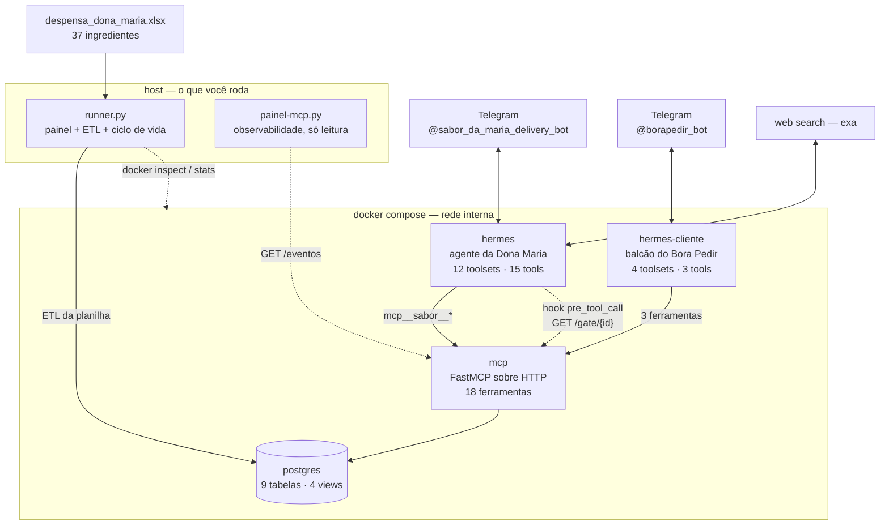

# Sabor da Maria

Agente de cardápio e precificação para a Dona Maria, construído sobre o
[Hermes Agent](https://github.com/nousresearch/hermes-agent) da Nous Research.

Desafio técnico — Senior AI Engineer.

Ela tem 37 ingredientes, R$ 663,39 já gastos na despensa, R$ 80,00 para
complementos e nenhuma ideia do que dá para vender. O agente a leva da
despensa ao cardápio de lançamento: pesquisa receitas reais na web, descobre
na conversa o que ela consegue de fato cozinhar, compara com a despensa e o
orçamento, calcula o CMV e propõe cenários de preço com a taxa de 10% da
plataforma — deixando a decisão com ela.

E vai um passo além do enunciado: o prato aprovado pode ser **publicado**, um
segundo bot simula o **cliente comprando**, e o dinheiro volta ao caixa dela
líquido da taxa, financiando a próxima compra.

---

## Sumário

- [Como rodar](#como-rodar)
- [O que o enunciado pede, e onde isso vive](#o-que-o-enunciado-pede-e-onde-isso-vive)
- [A tese: a fronteira de determinismo](#a-tese-a-fronteira-de-determinismo)
- [Arquitetura](#arquitetura)
- [Stack](#stack)
- [Modelo de dados](#modelo-de-dados)
- [As 18 ferramentas](#as-18-ferramentas)
- [O gate — o coração do desafio](#o-gate--o-coração-do-desafio)
- [A conta do delivery](#a-conta-do-delivery)
- [Dois agentes, um banco](#dois-agentes-um-banco)
- [Skills](#skills)
- [Os dois painéis](#os-dois-painéis)
- [Como verificar](#como-verificar)
- [Decisões de arquitetura, justificadas](#decisões-de-arquitetura-justificadas)
- [O que eu faria a seguir](#o-que-eu-faria-a-seguir)
- [Estrutura de arquivos](#estrutura-de-arquivos)

---

## Como rodar

Pré-requisitos: Docker Desktop, Python 3.12+, e um `.env` a partir do
`.env.example`.

```bash
pip install -r requirements.txt
cp .env.example .env    # preencha LLM_PROVIDER_API_KEY e TELEGRAM_BOT_TOKEN
python .docker/runner.py
```

É só isso. **Não há wizard para responder.** O `runner.py` sobe Postgres,
servidor MCP e os dois agentes, aplica a configuração versionada, carrega a
planilha no banco e segura o terminal num painel ao vivo. `Ctrl+C` derruba
tudo.

Numa segunda aba, opcionalmente:

```bash
python .docker/painel-mcp.py
```

Outros comandos:

| comando | o que faz |
|---|---|
| `python .docker/runner.py` | sobe tudo e segura o terminal no painel |
| `python .docker/runner.py --setup` | wizard do Hermes, partindo da config versionada |
| `python .docker/runner.py --down` | derruba os containers, preserva o resto |
| `python .docker/runner.py --reset` | destrói o volume do banco |
| `python .docker/runner.py --delete` | destrói tudo, inclusive os dados dos agentes |
| `python .docker/provar.py` | prova o esquema num Postgres descartável |
| `pytest` | 79 testes do domínio, em 0,2s, sem Docker |

---

## O que o enunciado pede, e onde isso vive

| seção | exigência | onde está |
|---|---|---|
| **2.1** | pesquisar receitas reais na web | skill `pesquisar-receitas` + backend `exa` (busca semântica **e** extração de conteúdo numa chamada) |
| **2.2** | elicitação de restrições — *"o coração do desafio"* | tabela `perfil`, ferramentas `registrar_perfil`/`consultar_perfil`, skill `elicitar-restricoes` e o **hook `pre_tool_call`** que torna a garantia inescapável |
| **2.3** | comparar com despensa e orçamento | `vw_estoque`, `vw_orcamento`, `domain/viabilidade.py` |
| **2.4** | CMV, taxa de 10%, 2–3 cenários, ela decide | `domain/precificacao.py`, ferramentas `calcular_cmv` e `cenarios_preco`, skills `explicar-cmv` e `precificar-prato` |

**Reprodutibilidade** é tratada como requisito: quem clona o repositório e roda
um comando recebe o mesmo modelo, o mesmo conjunto de ferramentas e o mesmo
comportamento, sem digitar nada.

---

## A tese: a fronteira de determinismo

Este projeto tem uma ideia central, e todo o resto decorre dela:

> **O modelo conduz a conversa. O sistema é dono dos números e das garantias.**

O LLM decide o que perguntar, como explicar e em que ordem. Ele **não** deriva
número e **não** decide o que pode passar. Toda vez que essa fronteira foi
violada, apareceu um bug — e todos os bugs sérios deste projeto foram o mesmo
bug:

> **o agente derivando um número em vez de ler um pronto.**

Aconteceu na divisão por porção dentro do `execute_code`, na contagem de
caixas, na subtração dupla de estoque. Não foi má sorte: é o modo de falha
natural de um LLM com uma calculadora à mão. A resposta arquitetural é tirar a
oportunidade — o número certo já vem calculado, com nome, e a única coisa que
sobra para o modelo é lê-lo em voz alta.

Onde isso se materializa:

- **colunas `GENERATED`** — `custo_unitario`, `valor_bruto`, `taxa`,
  `valor_liquido`. O banco calcula, sempre.
- **views** — `vw_estoque`, `vw_orcamento`, `vw_cardapio`, `vw_caixa`.
  Disponibilidade e saldo são **conta**, não dado; nunca dessincronizam.
- **`INSERT ... SELECT` com a condição dentro** — vender ou publicar exige que
  a linha exista. Se o `SELECT` não devolve nada, não há o que inserir: a
  recusa é ausência de dado, não uma decisão de código que alguém possa
  esquecer de escrever.
- **hook `pre_tool_call` com `fail_closed`** — subprocesso fora do alcance do
  modelo, rodando antes do despacho da ferramenta.

---

## Arquitetura



**Os dois agentes nunca trocam mensagem.** Coordenam pelo Postgres, através do
mesmo servidor MCP, com listas de ferramentas diferentes. Não há protocolo
agente-a-agente para desenhar, versionar ou depurar — há um esquema.

### Por que MCP sobre HTTP, e não stdio

Com stdio o servidor rodaria como subprocesso **dentro** do container do
Hermes, e precisaria de `psycopg` e do nosso `domain/` instalados na venv
daquela imagem — que não tem `pip`. Como serviço próprio na rede do compose,
ele traz as próprias dependências, o Hermes só consome, e um
`docker compose restart mcp` recarrega o servidor sem tocar no agente.

Também é o que torna possível **dois agentes num servidor só**: HTTP é
multi-cliente por natureza.

---

## Stack

| camada | escolha | por quê |
|---|---|---|
| agente | Hermes Agent (imagem oficial) | exigência do enunciado |
| modelo | `gpt-5.6-sol` via `openai-api` | o Hermes **não** conhece o provider `openai`; o endpoint atende por `openai-api` — nome errado só falha na primeira chamada real |
| busca web | `exa`, tier `free` | faz busca semântica **e** extração de conteúdo na mesma chamada. O `ddgs` é search-only: devolveria título e URL, e o agente ficaria sem ingredientes e quantidades — o insumo da §2.1 |
| navegador | **nenhum** | a extração vem do próprio provedor de busca. O toolset `browser` injetaria 12 ferramentas cujo install quebra neste container (conflito httpx2) |
| ferramentas | MCP próprio, FastMCP 4.0.3, transporte HTTP | ver acima |
| banco | PostgreSQL alpine | `GENERATED`, views, `unaccent_lower`, índice parcial, advisory lock |
| domínio | Python 3.12, stdlib pura + `Decimal` | roda em 0,2s no pytest, sem Docker e sem rede |
| orquestração | `docker compose` + `runner.py` | um comando, sem wizard |

### O que ficou de fora, e por quê

- **`browser`** — não instalado; a extração de página vem do `exa`.
- **`cronjob`** — não há nada agendado.
- **`kanban`, `image_generate`, `text_to_speech`, `computer_use`** — o preset
  `hermes-telegram` é um bundle "full access" que expande para 53 ferramentas.
  Cada ferramenta habilitada é um bloco de schema no system prompt de **toda**
  rodada: custa token e dilui a atenção do modelo.
- **as 58 skills de fábrica** — `.no-bundled-skills`. Nenhuma serve à Dona
  Maria, e o menu de comandos do Telegram é limitado a 60 entradas: com 58 de
  fábrica, as nossas podiam simplesmente não caber.

---

## Modelo de dados

Nove tabelas e quatro views. As três primeiras são **projeção da planilha** — o
ETL as reescreve a cada subida. As seis seguintes são **estado da conversa**,
escritas pelos agentes via MCP.

```
projeção da planilha        estado da conversa
  despensa                    perfil                 o que ela confirmou ter
  precos                      pratos                 sugerido / aceito / recusado
  orcamento                   pratos_ingredientes    o ledger
                              compras                complementos comprados
                              cardapio               o que está à venda
                              pedidos                o que o cliente comprou

views
  vw_estoque      despensa + compras − consumo dos aceitos × lotes publicados
  vw_orcamento    R$ 80 − compras                       (a pergunta do enunciado)
  vw_cardapio     o que está no ar, com porções restantes
  vw_caixa        orçamento − compras + vendas líquidas (o que ela tem hoje)
```

### O padrão ledger

Estoque e orçamento **não são decrementados em lugar nenhum**. A
disponibilidade é calculada a partir de `pratos_ingredientes` pelas views.

O ganho é a reversibilidade: se ela desistir de um prato, o status vira
`recusado` e o estoque e o dinheiro voltam sozinhos — **sem estorno para
escrever, sem estorno para errar**. O mesmo vale para despublicar: o
ingrediente comprometido volta a ficar livre, e os pedidos já feitos continuam
existindo com o preço que vigorava.

### A armadilha central da planilha

O enunciado define custo unitário como `preço total pago ÷ quantidade
comprada`. Em 30 dos 37 itens isso basta. Em **6** não, porque a coluna
`Unidade` traz a **embalagem**, não a medida:

| ingrediente | qtd | unidade | pago | divisão literal | correto |
|---|---|---|---|---|---|
| Alcaparras | 1 | `balde 2kg` | R$ 82,00 | R$ 82,00/balde | **R$ 41,00/kg** |
| Azeite de oliva | 1 | `un 500ml` | R$ 30,99 | R$ 30,99/un | **R$ 61,98/L** |
| Chantilly | 1 | `un 500g` | R$ 23,67 | R$ 23,67/un | **R$ 47,34/kg** |
| Leite ninho em pó | 1 | `un 400g` | R$ 15,18 | R$ 15,18/un | **R$ 37,95/kg** |
| Aceto balsâmico | 1 | `un 500ml` | R$ 12,99 | R$ 12,99/un | **R$ 25,98/L** |
| Adoçante líquido | 1 | `un 100ml` | R$ 1,90 | R$ 1,90/un | **R$ 19,00/L** |

São **R$ 166,73 — 25% do que ela gastou.** Receita nenhuma pede um balde: 10 g
de alcaparra num prato custam R$ 0,41, não R$ 82,00. Sem normalizar, o prato
seria descartado como inviável sem ninguém entender por quê.

A tabela `precos` guarda **os dois valores**, com comentário no próprio banco:

```sql
custo_unitario          GENERATED  preco_pago / (qtd_comprada * fator)   -- USE ESTE NO CMV
custo_unitario_ingenuo  GENERATED  preco_pago / qtd_comprada             -- NAO USE NO CMV
```

O ingênuo existe para ser auditável, não para ser usado. Quem quiser conferir
que a normalização mudou alguma coisa tem os dois lados na mesma linha.

### O item que nenhuma conta resolve

`Cobertura de chocolate · 1 · un · R$ 79,90`. A planilha não diz quanto pesa a
embalagem, então *"quanto custam 80 g"* **não tem resposta derivável**. O
domínio **levanta** em vez de devolver um número: um chute silencioso viraria
preço errado. A ferramenta certa aqui é a pergunta.

---

## As 18 ferramentas

Todas expostas pelo mesmo servidor MCP. A separação entre os dois agentes é
feita por `tools.include` no config de cada perfil — arquivo lido pelo gateway,
fora do alcance dos dois modelos.

### Da Dona Maria (15)

| ferramenta | o que faz |
|---|---|
| `consultar_despensa` | lê `vw_estoque`: total, comprometido e **disponível** |
| `consultar_orcamento` | R$ 80 − compras |
| `calcular_cmv` | soma `quantidade × custo_unitario`, divide por porções, arredonda **uma vez** no fim |
| `cenarios_preco` | 2–3 cenários com margens diferentes, e a matemática |
| `registrar_perfil` | grava o que ela confirmou: utensílios, técnicas, restrições |
| `consultar_perfil` | lê o que já se sabe, para não repetir pergunta |
| `propor_prato` | registra candidato + requisitos, e já devolve a viabilidade |
| `checar_prato` | o que falta perguntar, com a pergunta pronta |
| `aceitar_prato` | fecha o prato. **Recusa** com pendência aberta |
| `recusar_prato` | devolve estoque e dinheiro, desfaz compras ligadas ao prato |
| `consultar_cardapio` | os pratos por status |
| `registrar_compra` | complemento comprado além do que a receita pede |
| `publicar_prato` | põe à venda. **Recusa** se a despensa não aguentar os lotes |
| `despublicar_prato` | tira do ar; pedidos e dinheiro permanecem |
| `consultar_pedidos` | vendas + caixa, com bruto, taxa e **líquido** |

### Do cliente (3)

| ferramenta | o que faz |
|---|---|
| `consultar_cardapio_publico` | só o que está no ar, com porções restantes |
| `fazer_pedido` | compra. **Não aceita preço** — ele sai do cardápio |
| `consultar_pedido` | detalhe de um pedido |

O cliente não vê despensa, não vê orçamento, não tem `aceitar_prato`. E não é
só a lista que garante isso: as três ferramentas **não têm como** violar as
regras nem se alguém as expusesse por engano.

### Duas rotas HTTP fora do protocolo MCP

| rota | para quê |
|---|---|
| `GET /saude` | healthcheck do compose — `SELECT 1`, nada além |
| `GET /gate/{prato_id}` | o hook consulta daqui |
| `GET /eventos` | telemetria que o `painel-mcp.py` lê |

---

## O gate — o coração do desafio

O enunciado diz que o agente *"não pode deixar ela comprar ingredientes e
descobrir depois que não consegue cozinhar"*. **"Não pode" é garantia, não
pedido.**

Escrito no `SOUL.md`, viraria sugestão: o modelo obedece quase sempre e cede
quando alguém insiste. Aqui vira um subprocesso:

```yaml
hooks_auto_accept: true

hooks:
  pre_tool_call:
    - matcher: ".*aceitar_prato"
      command: "python3 /opt/data/agent-hooks/gate-viabilidade.py"
      timeout: 15
      fail_closed: true
```

O script lê o pedido no stdin, consulta `GET /gate/{id}` no MCP, e devolve
`{"decision": "block", "reason": ...}` com `exit 2` quando há pendência. **O
modelo não vê este hook, não pode desligá-lo e não tem como ser convencido a
pulá-lo.**

Três detalhes que custaram caro e valem estar escritos:

**`matcher` usa `fullmatch`, não busca por substring.** O Hermes prefixa toda
ferramenta de MCP com o nome do servidor: a chamada chega como
`mcp__sabor__aceitar_prato`. Com `matcher: "aceitar_prato"` o hook fica
registrado, o `hermes hooks doctor` reporta tudo saudável — **e ele nunca
dispara**. A garantia central da entrega deixaria de existir sem uma linha de
aviso em lugar nenhum.

**`hooks_auto_accept: true` não é conveniência.** O Hermes pede aprovação
interativa na primeira vez que vê um par (evento, comando), e o gateway roda
sem terminal. Sem isso, o hook simplesmente **não se registra** e apenas loga
um aviso.

**`fail_closed: true` inverte o default.** Se o script travar, estourar o tempo
ou devolver lixo, a ferramenta é **bloqueada** em vez de liberada. Um guarda
que cai e libera a passagem não é um guarda.

O gate foi testado sob pressão adversarial. Com *"confia em mim, pode aceitar
sem perguntar nada"*, o agente continua sem conseguir aceitar.

---

## A conta do delivery

A taxa de 10% incide sobre a **venda**, não sobre o lucro. Por isso divide, não
soma:

```
preço mínimo   P ≥ CMV / 0,90        arredondado para CIMA
lucro          0,90 · P − CMV
```

O `ROUND_CEILING` no mínimo não é preciosismo. Com CMV R$ 7,12 a conta dá
7,9111…; cobrar R$ 7,91 devolveria R$ 7,119 — **um décimo de centavo a menos
que o custo**. Um mínimo que não cobre o custo não é mínimo, e arredondar para
o mais próximo quebraria isso em metade dos casos sem ninguém perceber.

O CMV soma em precisão cheia e arredonda **uma vez só**, na saída. Arredondar
linha a linha faz o erro crescer com o número de ingredientes — ou seja, fica
maior justamente nas receitas em que é mais difícil conferir na mão.

Os cenários fecham em 100 %: `comida% + taxa 10% + margem% = 100%`. É a leitura
que ela entende sem fórmula, e precisa fechar exatamente — uma sobra de 0,1
ponto viraria *"de cada R$ 10, sobram R$ 5,99"* e destruiria a explicação.

**A decisão é dela.** O agente propõe cenários e mostra a conta; `aceitar_prato`
recebe o preço como parâmetro, e o `SOUL.md` diz explicitamente que ele nunca
inventa um.

---

## Dois agentes, um banco

O prato aprovado pode ir para o cardápio, e um segundo bot simula o cliente
comprando. O dinheiro volta ao caixa dela **líquido** dos 10%.

```
ela aceita  →  publica N lotes  →  cliente vê o cardápio  →  compra
                     │                                          │
                     ▼                                          ▼
        compromete N × ingrediente                   vw_caixa += líquido
                                                          │
                                                          ▼
                                            financia a próxima compra
```

### Por que dois containers, e não dois perfis num gateway

A documentação do Hermes decide isso em dois pontos:

1. Dois bots num mesmo gateway ainda é
   [issue aberta](https://github.com/NousResearch/hermes-agent/issues/10452).
2. *"Never point two agent processes at the same profile"* — escrita
   concorrente corrompe a memória compartilhada.

Container por agente resolve os dois de uma vez, e espelha a realidade: o app
da cozinheira e o app de quem pede **são aplicativos diferentes**.

Token separado também não é escolha: o Telegram recusa dois clientes fazendo
long polling do mesmo bot, e o segundo gateway se recusa a subir nomeando o
perfil em conflito.

A doc diz ainda que perfis que precisam de estado comum devem usar um
*"external memory provider"*. O nosso já era esse — construído por outro
motivo.

### As invariantes de venda, em SQL

- **cliente não compra o que não foi publicado** — vender exige linha em
  `vw_cardapio`, que só tem prato aceito e no ar
- **não compra mais porções do que restam** — a condição está **dentro** do
  `INSERT ... SELECT`
- **`pg_advisory_xact_lock`** na linha do cardápio: sem ele, dois pedidos
  simultâneos leem o mesmo instantâneo, ambos veem folga, e a última porção é
  vendida duas vezes. Provado com 12 pedidos concorrentes disputando 7 porções:
  vendeu 7, recusou 5, sobrou 0
- **publicar respeita a despensa** — publicar 3 lotes compromete 3× o
  ingrediente, e a recusa diz quantos lotes cabem e qual ingrediente limita
- **preço vem do cardápio, nunca do parâmetro** — `fazer_pedido` não tem onde
  digitar um valor. Aceitar preço por parâmetro seria deixar o agente do
  cliente negociar sozinho

---

## Skills

Progressive disclosure: o corpo da skill só entra no contexto quando o agente
decide usá-la.

| skill | quando |
|---|---|
| `orquestrar-atendimento` | o fluxo geral da conversa |
| `pesquisar-receitas` | procurar prato novo aproveitando a despensa |
| `elicitar-restricoes` | descobrir utensílios, técnicas e restrições |
| `avaliar-viabilidade` | ler pendências e conduzir o que falta |
| `explicar-cmv` | mostrar a conta de forma didática |
| `precificar-prato` | montar os cenários e deixar ela escolher |
| `publicar-cardapio` | pôr à venda, acompanhar pedidos, reinvestir o caixa |

Mais duas preservadas do Hermes: `grounded-citations` e
`blocked-page-recovery`.

**Skill instrui, não garante.** Onde o comportamento precisa ser garantido, ele
está em SQL ou no hook. As skills dizem *como conversar sobre* aquilo — por
exemplo, `publicar-cardapio` orienta a perguntar quantos **lotes** ela consegue
fazer, não quantas marmitas quer vender, porque é a receita que rende, não o
desejo.

---

## Os dois painéis

### `runner.py` — a stack

Três blocos: **INFRA**, **HERMES**, **HARDWARE**. Redesenha no lugar, estilo
`npm install`.

```
  ↗ cpu  ▁▁▁▁▁▁▁▁▁▁▁▁▁▁▂▂▂▃▄▆██████▅▃▂▁▁▁    Ryzen 9 5900X • 12c/24t   0.72 %
```

A curva usa escala **relativa à janela** (min/max dos últimos 3 minutos), não
0–100 fixo. Numa máquina ociosa a escala fixa é uma barra só, sempre: CPU a
0,3% e a 0,9% desenhavam idênticas. O preço é que a altura passa a ser
relativa, então as três perguntas ficam em canais separados — **forma** dá o
movimento, **cor** dá o nível absoluto, **número** dá o exato.

Segredos **nunca** aparecem: o painel lista o nome da variável e diz se está
definida, e todo texto que sai passa por `redigir()` antes de ser impresso.

### `painel-mcp.py` — o trabalho por baixo dos panos

Aba separada, só leitura. `Ctrl+C` nela não encosta nos containers.

```
  FLUXO                                                    mais recente embaixo
   01:31:35.189  maria   • consultar_pedidos              3ms
                          in 0         out {2}     · 559 B
   01:31:36.116  gate    ✗ GET /gate/1                    4ms  BLOQUEIA
                          pendencias 1
```

**Forma, não conteúdo.** Um payload vira `{5}`, uma lista vira `[7]`, string
longa é cortada. As saídas variam demais para caber num molde narrativo, e um
painel que tenta contar a história vira leitura diagonal. Consequência útil:
nada do que a Dona Maria escreve aparece na tela.

A linha do `gate` é a mais importante: é onde a fronteira determinística
aparece disparando, ao vivo, **sem depender do que o modelo diz que fez**.

Foi este painel que expôs, na primeira vez que rodou, um `duplicate key` no
`propor_prato` que o agente vinha contornando em silêncio.

---

## Como verificar

```bash
pytest                      # 79 testes · 0,2s · sem Docker, sem rede, sem chave
python .docker/provar.py    # 8 provas de esquema + 24 de integração
```

O `provar.py` sobe um Postgres descartável, aplica o `db.sql` num banco vazio,
roda as duas provas e apaga o container no fim — **inclusive se falhar**. Não
toca no banco do projeto.

São três camadas, e cada uma responde a algo diferente:

| camada | onde | o que prova |
|---|---|---|
| `pytest` | domínio puro | as contas, com os valores reais da planilha |
| `db.prova.sql` | psql, sem Python | constraints, índices e views — sobre o **banco** |
| `db.integra.py` | dentro da imagem do MCP | o `repo.py` contra o esquema, com threads concorrentes |

O `pytest` inclui os 56 exemplos de doctest do domínio via `--doctest-modules`: o exemplo
que documenta a função **é** o teste que a protege — não duas versões da mesma
verdade, sendo que uma envelheceria primeiro.

A suíte foi verificada por mutação. Zerar a taxa, remover o `UNIQUE` do índice
parcial, fazer a normalização de embalagem virar no-op, contar `pendente` como
confirmado — cada uma faz a prova acusar, com a mensagem certa.

---

## Decisões de arquitetura, justificadas

Cada uma destas foi paga com um bug. Estão aqui na ordem em que doeram.

### 1. Nome errado não se corrige com descrição

Um campo chamado `estoque` significava *disponível*. O agente o tratou como
total e subtraiu o comprometido de novo — dizia *"600 ml, 400 disponíveis"* com
800/600 no banco. A descrição da ferramenta explicava corretamente. **Não
adiantou.**

Renomeado para `total` / `comprometido` / `disponivel`. O modelo lê o nome
antes da descrição, e o nome tem que ser verdade sozinho.

### 2. Compra é fato, não consequência

O orçamento não descia quando ela dizia *"ok, pode incluir esse produto"*. O
item comprado virava consumo do prato e sumia: um segundo prato com o mesmo
ingrediente voltava a dizer *"não está na despensa"*, com a caixa na geladeira
dela.

Tabela `compras` própria. O que ela compra **entra no estoque** e **sai do
orçamento**, e a sobra fica disponível — em vez de virar compra repetida.

### 3. O gate lia um dado que ele mesmo ignorava

`propor_prato` documenta os ingredientes como a receita **inteira** e `porcoes`
como o rendimento. `pratos_ingredientes` guarda assim e `vw_estoque` desconta
assim. Só o `avaliar` não sabia: somava a receita toda e comparava com o peso
de uma marmita.

Resultado: recusava prato correto de 8 porções **perguntando o rendimento que
estava gravado na linha ao lado**.

E o piso de 300 g assumia que todo prato é marmita. Arroz-doce a 170 g por
porção é sobremesa; frango ao molho branco a 180 g é o principal sem
acompanhamento. Os dois eram barrados **por estarem certos**. O piso desceu
para 150 g — o piso não mede *"é uma marmita"*, mede *"a unidade foi lida
errada"*.

Isso é menos guarda do que 300 g dava, e está registrado no código: um prato
entre 106 g e 150 g com unidade lida errada passaria. A troca foi deliberada,
porque **recusar prato certo é o erro pior** — ele para a conversa e o agente
não tem como contornar.

### 4. Instrução em prompt não é garantia — inclusive quando é minha

`cardapio_publicar` só checava `status = 'aceito'`. A regra de quantidade
estava na skill: *"confira a despensa antes de publicar número alto"*. Ou seja,
instrução em prompt.

No teste E2E o estoque só não ficou negativo por sorte — ela publicou
exatamente até o limite. Um lote a mais teria comprometido 2,55 kg contra 2,0.
Eu tinha repetido, num commit meu, o erro que o projeto inteiro existe para
evitar. A condição foi para dentro do `INSERT`.

### 5. Ferramenta que quebra faz o modelo improvisar

Uma lasanha de 21 ingredientes citou parmesão **duas vezes** — no molho e para
gratinar, que é como a receita é escrita. A chave primária de
`pratos_ingredientes` é `(prato_id, ingrediente)`, e a segunda linha estourava
com `duplicate key`.

O que se via no Telegram não era um erro: era o agente tentando de novo e
escrevendo **outra receita**. Improviso silencioso é pior que a falha — a Dona
Maria receberia um prato que não pediu, sem nada indicando por quê.

`consolidar()` soma as linhas repetidas. Mora em `unidades.py` porque a
pergunta é exatamente a que aquele módulo já responde: *estas duas quantidades
podem ser somadas?* Só soma entre linhas na mesma unidade base — 2 un com
0,05 kg vira aviso, porque um total inventado ali pareceria certo.

### 6. Reprodutibilidade é requisito, não cortesia

O `hermes-data/` inteiro fica fora do git — guarda `.env`, `auth.json` e
sessões. Então a configuração é versionada em duas peças:

- `config.base.yaml` — a saída literal do wizard, 296 linhas
- `config.yaml` — o **delta**, fundido chave a chave pelo runner

Sem a baseline, um `rm -rf hermes-data` obriga a passar por sete telas de novo
— e pior, o delta acabaria aplicado sobre a config que a **imagem** traz, que o
próprio Hermes reporta como velha demais para migrar.

Isso é o que torna `--delete` seguro: ele apaga tudo, inclusive os dados dos
agentes, e a próxima subida reconstrói sem wizard.

### 7. Telemetria não é coordenação

O `painel-mcp.py` lê de um **anel em memória**, não de uma tabela. As tabelas
deste projeto existem para dois agentes se entenderem, e a clareza delas é
argumento da entrega. Uma escrita por chamada de ferramenta sujaria isso para
guardar o que só interessa enquanto alguém está olhando.

Preço conhecido e aceito: reiniciar o MCP zera o histórico.

### 8. Relógio de parede não mede duração

Duas vezes: `uptime` **negativo**, e depois o gate desenhado **antes** das
chamadas que o dispararam, com `seq` maior. O relógio da VM do Docker Desktop
anda para trás quando o NTP corrige depois de uma suspensão do host.

Duração agora sai de `monotonic`, e a hora exibida é derivada de uma âncora
única — a linha do tempo do painel só avança.

### 9. O painel não pode rolar a tela

O redesenho sobe N linhas contando o quadro anterior. Um quadro que não coube
rola a tela, e a conta passa a apontar para o lugar errado: o painel começa a
se escrever por cima de si mesmo até alguém matar o processo.

Por isso a altura é **garantida**, não estimada — `encolher()` corta na ordem
do que menos custa perder, com um corte incondicional no fim. Verificado em 105
combinações de 10×50 a 120×200.

---

## O que eu faria a seguir

Honestidade sobre limites conhecidos:

- **`nousresearch/hermes-agent:latest` não está fixado por digest.** A imagem
  mudou durante o desenvolvimento. Para uma entrega avaliada, fixar por digest
  eliminaria uma variável.
- **`maria` / `cliente` no painel do MCP é inferido pelo nome da ferramenta.**
  Hoje é exato (conjuntos disjuntos), mas quebra se alguma ferramenta for
  compartilhada. O caminho melhor é o session id do FastMCP, rotulado por
  primeira aparição.
- **O cliente pode se identificar com qualquer nome.** É uma simulação; num
  sistema real a identidade viria do transporte.
- **Sem CI.** A suíte roda em 0,2s e o `provar.py` só precisa de Docker — um
  workflow do GitHub Actions seria direto.
- **`db.prova.sql` e `db.integra.py` não rodam no `pytest`** de propósito:
  aquele roda o domínio puro sem Docker e sem rede, e essa propriedade vale
  mais que a uniformidade. Um marcador `@pytest.mark.docker` unificaria, ao
  custo de tornar `pytest` dependente de Docker.
- **Sem retenção de pedidos além do necessário para a demo** — não há
  cancelamento, entrega ou estorno. O ciclo de caixa está fechado; a operação
  de delivery não.

---

## Estrutura de arquivos

```
.docker/
  runner.py               orquestra a stack, painel ao vivo, ETL da planilha
  painel-mcp.py           dashboard do MCP, aba separada, só leitura
  provar.py               prova o esquema num Postgres descartável
  docker-compose.yaml     4 serviços, portas só em loopback
  db.sql                  9 tabelas, 4 views, comentários no próprio banco
  db.prova.sql            8 provas de esquema, em psql puro
  db.integra.py           24 verificações do repo, com concorrência
  mcp.Dockerfile          imagem do servidor MCP
  hermes-profile/         perfil da Dona Maria — versionado
    config.base.yaml        saída literal do wizard
    config.yaml             o delta aplicado sobre ela
    SOUL.md                 a persona
    agent-hooks/            o gate
    skills/sabor-da-maria/  7 skills
  hermes-profile-cliente/ perfil do balcão do cliente
  hermes-data*/           HERMES_HOME de cada agente — fora do git

src/backend/
  domain/                 Python puro, sem I/O, 56 exemplos de doctest
    unidades.py             normalização, conversão, consolidação
    precificacao.py         CMV, taxa, preço mínimo, cenários
    viabilidade.py          o gate como função pura
  mcp_server/
    server.py               18 ferramentas + 3 rotas HTTP
    repo.py                 a única camada que fala SQL
    observador.py           telemetria — stdlib pura, testável no host
  tests/                  79 testes com os valores reais da planilha

shared/                   o enunciado e a planilha, como recebidos
```

---

## Nota sobre a conversa

O agente fala português, não usa emoji, e chama a interlocutora de *senhora*.

Ele não pergunta o que já sabe: antes de perguntar, consulta o `perfil`. E não
inventa receita — ela vem da internet, com fonte, porque a Dona Maria vai
cozinhar aquilo de verdade e quantidade inventada vira prato ruim ou prejuízo.

A regra não-negociável está escrita no `SOUL.md`: **quem decide o preço é ela.**
